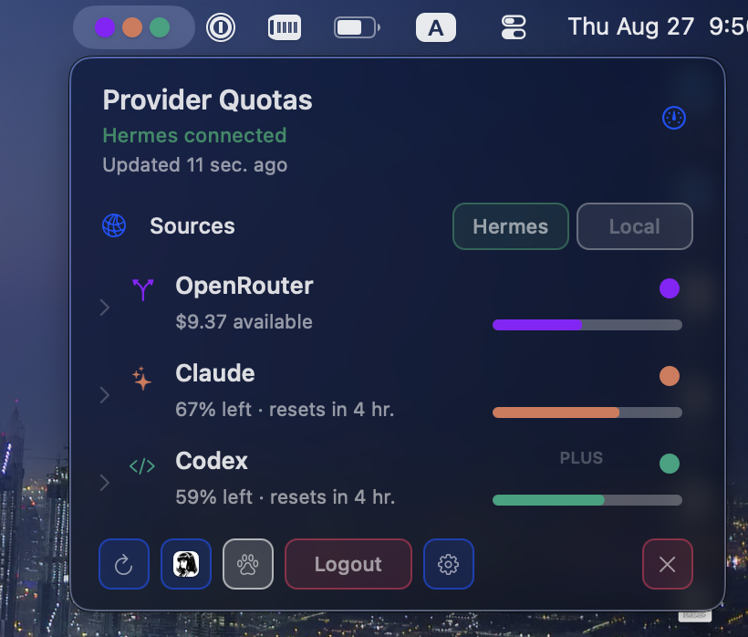
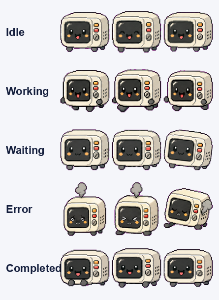

# Quota Viewer iOS 👀

A macOS **menu-bar app** + **Hermes gateway plugin** that shows live account
quota for your Hermes providers — **OpenRouter**, **Claude**, and **Codex** —
with usage bars, reset times, and an animated **per-provider pet**.



It works with **any Hermes gateway**: the app piggybacks on the Hermes Desktop
app's own gateway URL + session, so it shows exactly what your Desktop can see
(local backend or remote gateway) — nothing is hardcoded. It also has a
**Local** source that reads the providers authenticated directly on your Mac
(their own usage APIs), with no gateway at all.

The sources are **configured by you** — nothing is assumed or hardcoded. Both
**Hermes** and **Local** start **off**; the `Sources` row has an enable chip for
each, and you turn on the ones you want. The app uses **all enabled sources at
once**, with no fallback: enable both and each source's providers are listed
together under a small source header, so the same provider (e.g. Claude) can
appear once per source. Disabling a chip drops that source's providers. With none
enabled the menu says so; when a source is disconnected its providers still list
as **Disconnected**. Hermes has a gateway session, so it gets **Login** /
**Logout** buttons; Local providers authenticate via their own CLIs
(`claude login`, etc.).



## How it works

- **`dashboard/`** — the **`provider-quota`** gateway plugin, serving
  `/api/plugins/provider-quota/quotas` (and `/pets`). It reads each provider's
  usage from the credentials already in the gateway session, so it stays linked to
  the gateway it's installed in. The provider set is **configurable per gateway**
  so anyone can reuse it — see below.
- **`session-activity/`** — a second gateway plugin, serving
  `/api/plugins/session-activity/activity`: the Hermes turns RUNNING right now
  (Desktop chats/bots and `tui_gateway` turns — which REST never marks
  `is_active`), each with its model so the pet colours it per provider. It reads
  only the gateway's own logs + active-sessions registry (no session DB / internals),
  so it needs no privileged capabilities and stays enabled. Both plugins install
  together (`install.sh`).
- **`menubar/`** — the macOS menu-bar app. Every 60s it runs `desktop-quotas.sh`,
  which resolves the gateway your Hermes **Desktop** is bound to and fetches the
  endpoint. Portable (system `python3` + `openssl`), no extra deps.
- **`local-quotas.sh`** — the **Local** source. When Local is enabled it reads
  each provider's usage API directly from the credentials on this Mac: Claude
  from `~/.claude/.credentials.json` or the login Keychain, Codex from `~/.codex`
  (or a Goose `chatgpt_codex` token), OpenRouter from `OPENROUTER_API_KEY`, and
  **opencode** from the OpenRouter key opencode itself authenticated with
  (`~/.local/share/opencode/auth.json`) — shown as its own row with the same
  credits data. A
  provider only appears if its credential exists locally. (Gemini/xAI have no
  simple usage API, so they're skipped.)
- **`desktop/`** — optional Hermes Desktop sidebar page.

The app fetches from **each enabled source** and lists them together, grouped by
source — it never falls back one to the other. A disconnected source's providers
still list (as **Disconnected**); when every enabled source is down the activity
pet shows a "not working" state (red halo + `!`).

## Install

On the machine running your Hermes gateway:

```bash
./install.sh      # install + enable BOTH plugins (provider-quota + session-activity),
                  # then restart the dashboard to load the routes
./verify.sh       # smoke-test the endpoint
```

On your Mac:

```bash
./install-menubar.sh   # builds/installs the menu-bar app; if a Hermes gateway is
                       # present on this same Mac it also runs install.sh for you
```

For a **remote** gateway, run `install.sh` on the gateway host and
`install-menubar.sh` on your Mac.

## Configuring providers (per gateway)

The plugin reports on a configurable set of providers, so it's reusable in any
setup — it isn't tied to one person's provider list. Set the
`PROVIDER_QUOTA_PROVIDERS` env var on the gateway to a comma-separated list of
provider slugs (optionally `slug=Label`):

```bash
# just the two you use, with a custom label
PROVIDER_QUOTA_PROVIDERS="anthropic=Claude,openrouter"
```

- Unset → defaults to `openrouter,anthropic,openai-codex`.
- Slugs are whatever your gateway's `account_usage` supports; unknown slugs get a
  title-cased label.
- Every quota is read through the **host gateway's own credentials**
  (`account_usage`), and the response carries the gateway's `broker` host — so
  the plugin always stays linked to the gateway it runs in, whatever the set.

## Features

- Each provider shows a brief row with a **bar graph in the provider's own
  colour** (remaining quota); **click to expand** for per-window bars, reset
  times, and details. Each row has an **eye toggle** for whether that provider's
  dot appears in the **closed** menu bar, so you can keep only the ones you care
  about up top.
- The **closed menu-bar** shows a coloured dot per provider, **grouped by source
  section** (an extra gap between Hermes and Local) so you can tell them apart at
  a glance; a provider that's **offline or out of quota** gets a **bold red ring**
  around its (still provider-coloured) dot. A provider that's connected but can't
  read its usage right now (e.g. a transient HTTP 429) is **not** flagged red —
  it keeps its last-known quota (cached up to 15 min) so a rate-limit blip doesn't
  read as an outage.
- When an enabled source is disconnected, its providers still list, each marked
  **Disconnected**, so you always see what's configured and what's down.
  Disabling a source (its chip) removes all providers linked to it.
- Each source's own controls live **in its header row** as a tidy, evenly-spaced
  row of icon buttons, next to its name and connected/disconnected state — for
  Hermes, **Login/Logout** and **Setup** (opens the Hermes Desktop gateway page),
  plus a **Refresh** that re-checks that whole source (a spinner while it fetches).
  The bottom action bar has just **Close**. Switching a source on shows an
  **"Activating …" spinner** in its place until its first quotas land.
- **Per-source pets** — **one** animated companion **per source** (Hermes and
  Local), configured with two icon buttons **in the source header row**: a **paw**
  that toggles the pet on/off and the **pet's own picture** (click it to switch to
  the next installed pet) — two sources, two independently configured pets.
  **Right-click** a pet for a quick menu: **Pet Size** (three sizes — Small /
  Medium / Large — for the whole strip, remembered across launches) and **Turn
  Off … Pet** (disables that source's pet and immediately syncs the menu's paw
  toggle). Under
  the pet is a row of session marks that appears **only while sessions are
  actually running** — nothing when the source is idle. Each **actively-running**
  session is **one dot in its provider's colour** (so several sessions → several
  dots, and several of the same provider → several same-coloured dots); when a
  session **finishes its dot simply disappears** (no lingering checkmark), so the
  row only ever shows what's live right now. **Local**
  reads the **`claude` and Codex sessions** on this Mac — for Claude it reads the
  live turn state from the transcript's tail (a finished turn clears the dot at
  once, no trailing lag), for Codex it watches `~/.codex` rollout freshness (with
  a wider window, since Codex writes in bursts); **Hermes** scans **every gateway
  profile's
  recent sessions** and treats one as live from its **`is_active`** flag (the
  gateway's real "working now" signal — idle/open sessions read false), so its dot
  also **clears with no lag** the moment a turn ends, and colours it by that
  session's **`billing_provider`**. That catches a **bot conversation** too (those
  run as `source: cli` sessions that never show up in the aggregate
  `active_agents`/`active_sessions` counters). Dots map **only to genuinely running
  sessions** — the pet may animate as "working" when the Desktop is active (e.g.
  while you sign in), but it shows **no dots** unless a session is actually live.
  So a running **OpenRouter** session shows a **purple** dot
  (Claude orange, Codex green, Copilot grey) — not a generic colour, and only
  while it's live; the moment it finishes, the dot clears. Provider identity (colour, label,
  icon) is drawn from one canonical map, so a provider like **Codex looks the same across
  the Local and Hermes sources**. The picker offers **Nukey** (Hermes's default)
  plus **Boba, Capy and Scoop** and whatever else is installed —
  `install-menubar.sh` fetches those three from the
  [petdex](https://petdex.dev) catalog Hermes itself uses, while the **Lulu**
  capybaras and **cats** are hidden. Every pet animates via the shared
  Hermes/petdex row taxonomy (idle / running / waiting / …); the app measures each
  sheet's **per-row frame count** from its alpha, so pets with shorter rows (e.g.
  the duck's 4-frame idle vs. Nukey's 8) loop cleanly instead of flickering
  through blank cells, and it plays every frame of a row at a **steady ~5 fps**
  (one frame per two redraw ticks, so each frame is held for exactly the same
  time — even, never staggered). Pet art is loaded from your local Hermes install
  / petdex and is not redistributed here.
- **Hermes and Local, together** — enable each source yourself (both off by
  default, nothing hardcoded); the app lists **all enabled sources at once**,
  grouped by source, so the same provider can appear once per source. No
  fallback. Local reads the providers authenticated on this Mac directly.

## Requirements

Despite the name, this is a **macOS** app (an AppKit menu-bar agent) — it does
not run on iOS.

- **macOS 13 (Ventura) or later**.
- **Xcode command-line tools** (`xcode-select --install`) — `install-menubar.sh`
  compiles the app with `xcrun swiftc`.
- **A source** — either:
  - **Hermes Desktop** installed and signed in (the app reuses its session and
    stores no credentials of its own), with a **Hermes gateway** running the
    `provider-quota` plugin (`./install.sh` on the gateway host); **or**
  - **Local** — provider logins on this Mac: a Claude/Anthropic OAuth login
    (`claude login`), a ChatGPT/Codex login (`~/.codex`),
    `OPENROUTER_API_KEY`, and/or an `opencode auth login` (OpenRouter).
- Provider credentials for whichever gateway you use (you only see quota for the
  providers that are actually signed in): an OpenRouter API key, a
  Claude/Anthropic OAuth login, and/or a ChatGPT/Codex login.
- `python3` and `openssl` — both preinstalled on macOS; the quota helper needs
  no extra Python packages.

## License

MIT — see [LICENSE](LICENSE).
